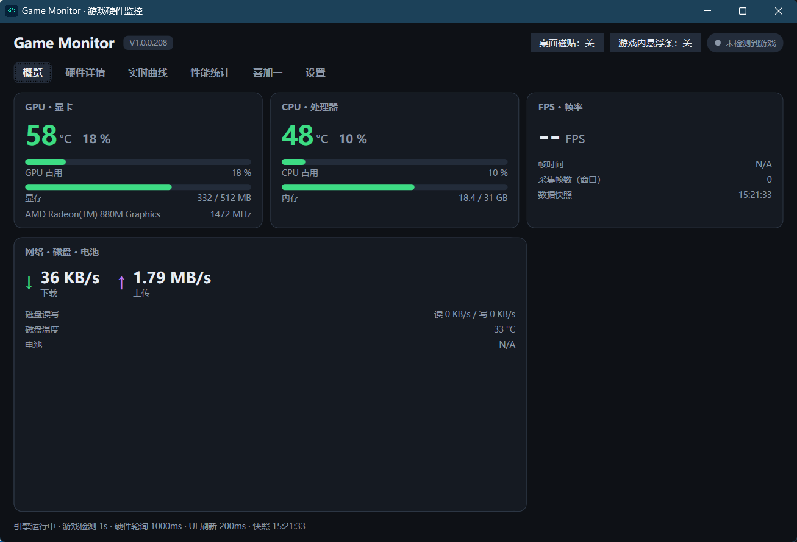
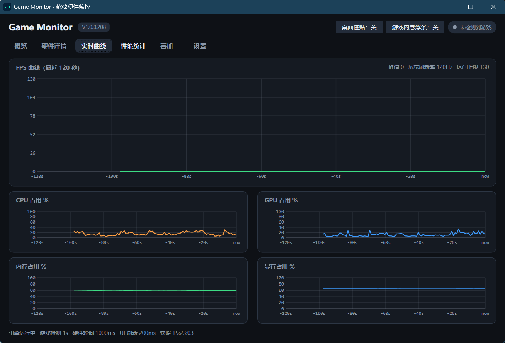
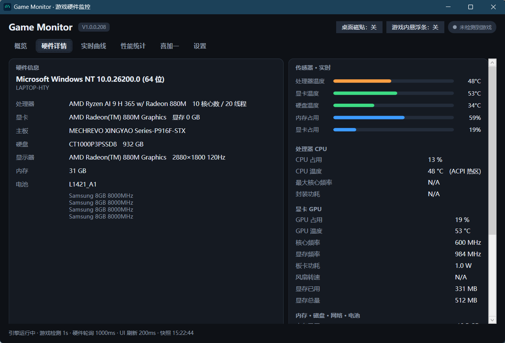
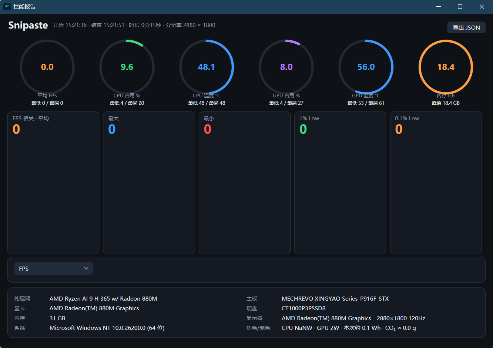

# BFV FPS Monitor · 游戏硬件监控

<div align="center">

**Game Monitor · 通用游戏硬件监控（PresentMon + LibreHardwareMonitor）**

**Language:** [English](README.en.md) | [简体中文](README.md)

</div>

---

> 一款 Windows 通用游戏性能监控工具（对标「游戏加加」个人版）：自动识别游戏进程，实时显示 **FPS / 帧时间 / 1% Low / 0.1% Low**、**CPU · GPU 负载 / 温度 / 功耗**、**内存 / 显存 / 磁盘 / 网络 / 电池**，并提供 **OSD 悬浮条、桌面监控磁贴、任务栏迷你监控条、游戏会话性能报告、CSV 日志与限免游戏情报**。
>
> 项目起源于《战地 5》（Battlefield V）的帧率监测困局：在反作弊环境下主流监控工具大多无法在游戏内显示 FPS / 帧时间，遂自研解决、逐步泛化为通用游戏监控器，项目名沿用（详见文末「项目缘起 & 致谢」）。

---

## ✨ 功能特性

### 🎮 游戏进程自动识别

- 内置主流游戏白名单：战地系列（BFV / BF1 / BF2042 / BF4）、CS2 / CSGO、Apex、堡垒之夜、瓦罗兰特、PUBG、守望先锋、使命召唤系、GTA5、荒野大镖客 2、赛博朋克 2077、艾尔登法环、怪物猎人、刺客信条系、原神、鸣潮、绝区零、星穹铁道、DNF、穿越火线、剑网 3、逆水寒 等，**支持前缀模糊匹配**（如 `cod` → `CoDWaW`）
- **全屏窗口启发式**：无标题栏且覆盖主显示器 ≥90% 的窗口也视为游戏
- 自动排除系统 / 桌面 / 浏览器 / 通讯 / 开发工具等进程
- 支持在「设置」中**手动固定**任意进程，也可关闭自动检测

### 📊 实时监控面板

- **FPS**：瞬时 / 平均 / 1% Low / 0.1% Low / 帧时间 / 总帧数（滑动 1000 帧窗口）
- **硬件**：CPU·GPU 负载、温度、核心 / 显存频率、功耗、风扇转速；内存、显存、磁盘读写与温度、网络上下行、电池
- 主窗口 7 张实时曲线：FPS / CPU 占用 / GPU 占用 / CPU 温度 / GPU 温度 / 内存 / 显存（最近 120 秒）

### 🖥 OSD 悬浮条

- 游戏加加风格：勾选显示 **FPS / CPU 负载 / CPU 温度 / GPU 负载 / GPU 温度 / 网络**
- 位置：左上 / 顶部居中 / 右上，或直接拖动自定义（自动记忆）
- 字号、背景不透明度可调
- 默认锁定（鼠标穿透、不抢游戏焦点），**`Ctrl+Alt+O`** 解锁拖动

### 🧱 桌面监控磁贴 & 任务栏监控条

- 三种风格：**紧凑横条 Bar / 卡片网格 Card / 任务栏细条 Taskbar**
- 鼠标穿透开关；主窗口最小化自动折叠为任务栏角落小条；位置记忆
- 独立**任务栏迷你监控条**（输入法状态条风格）：默认嵌入任务栏，可拖出浮窗、自动吸附、随任务栏自适应

### 📈 游戏会话统计与性能报告

- 检测到游戏自动开新会话，游戏退出自动统计并**弹出性能报告**（可在设置关闭）
- 统计指标：FPS 平均 / 最高 / 最低 / 1% Low / 0.1% Low、总帧数、CPU·GPU 负载与温度、内存 / 显存峰值、上下行流量、CPU/GPU 平均功耗
- 环保附加：会话**能耗估算 kWh** 与 **CO₂ 排放估算**（全国电网平均排放因子 0.556 kg/kWh）
- **性能报告 1.0**：环形仪表总览 + FPS 折线图 + 硬件状态区块
- **性能报告 2.0**：五大 FPS 指标卡 + CPU/GPU 温度条 + 多指标折线图 + **时间轴回放滑条** + 导出 JSON
- 会话以 JSON 落盘（`sessions/`），可回看历史

### 💾 CSV 日志

- 输出 `bfv_fps_log.csv`，三种模式：`0=关闭` / `1=帧级` / `2=秒级`
- 列：`Timestamp,Game,FrameTimeMs,FPS,AvgFps,OnePercentLow,ZeroPointOnePercentLow,GpuTemp,GpuLoad,GpuMemUsed,CpuLoad,CpuTemp,RamUsedGb,DownKbps,UpKbps`

### 🎁 限免游戏情报

- 聚合 **Epic 官方限免**、**Steam 100% 折扣**、**GOG / Humble 特价**（CheapShark）情报
- 内嵌 **WebView2 商店登录窗**：登录一次 Cookie 持久化，凭证不出本机，可一键清除，手动点「获取」完成领取

### 🛡 反作弊兼容设计（EA AntiCheat）

- EA AntiCheat 等反作弊驱动加载后会**全局拒绝新建 ETW 会话**，但对已存在的会话不干预
- 监控启动即抢占建立 PresentMon **全进程预捕会话**，游戏出现后按 PID 过滤
- 定向追踪连续被拒时自动降级为全进程捕获；PresentMon 异常退出自动按退避递增重启（2s→60s），并自动清理残留 ETW 会话

### 🛠 工程细节

- 全局异常兜底：出错弹提示不闪退
- 事件日志 `engine.log`（滚动保留 1 份历史 `engine.log.1`）
- 构建自动递增版本号 `1.0.0.N`（`version_build.txt`）
- WPF 深色主题；图表 / 仪表 / 趋势线全部自绘（`ChartPlot` / `GaugeRing` / `Sparkline`），零第三方绘图依赖

## 🖼 界面预览


| 主界面 | 实时曲线 |
| :---: | :---: |
|  |  |

| 硬件信息 | 性能统计 |
| :---: | :---: |
|  |  |

## 💻 环境要求

| 项目 | 要求 |
| --- | --- |
| 操作系统 | Windows 10 1809+ / Windows 11（64 位） |
| 运行时 | .NET 10.0（`net10.0-windows`），或使用自包含发布 |
| 权限 | **管理员权限**（读取硬件传感器 + PresentMon ETW 捕获；`app.manifest` 已声明 `requireAdministrator`） |
| WebView2 | Microsoft Edge **WebView2 Runtime**（仅商店登录窗需要，缺失时程序会提示下载） |
| 随附文件 | `PresentMon.exe`（ETW 帧采集，随仓库 / 发布包携带） |
## 🔧 构建

```powershell
# 还原 + 编译
dotnet restore
dotnet build -c Release

# 单目录自包含发布（免装 .NET 运行时）
dotnet publish BFV_FPS_Monitor.csproj -c Release -r win-x64 --self-contained true -p:PublishSingleFile=true
```

> 版本号：每次编译自动 +1，从 `version_build.txt` 读取并写回，最终版本为 `1.0.0.N`（N 为构建号）。
> 若以源码目录运行，请确保 `PresentMon.exe`、`app.ico`、`logo.png` 位于程序目录（csproj 已配置 `CopyToOutputDirectory`）。

## 🚀 使用

1. **以管理员身份运行** `BFV_FPS_Monitor.exe`（首次启动会有 UAC 提示）。
2. 启动游戏（或在设置中手动固定进程），引擎自动完成「检测 → 绑定 → 帧采集」。
3. 主窗实时查看指标与曲线；按需开启 **OSD 悬浮条 / 桌面磁贴 / 任务栏监控条**。
4. 游戏退出后自动弹出性能报告；历史会话在「游戏性能统计」页回看。
5. 「限免游戏领取」页查看 Epic / Steam / GOG / Humble 限免与特价，内置商店登录窗跳转领取。

### OSD 快捷键

| 操作 | 快捷键 |
| --- | --- |
| 解锁 / 锁定 OSD（拖动 / 穿透） | `Ctrl+Alt+O` |

## ⚙️ 配置（settings.json）

配置保存在程序目录的 `settings.json`（也可在主界面「设置」页修改，改动即时保存）：

| 键 | 默认值 | 说明 |
| --- | --- | --- |
| `AutoDetect` | `true` | 自动检测游戏进程 |
| `PinnedProcess` | `""` | 手动固定的进程名（空 = 回到自动检测） |
| `HwPollMs` | `1000` | 硬件轮询间隔（毫秒） |
| `CsvModeInt` | `1` | CSV 模式：`0` 关闭 / `1` 帧级 / `2` 秒级 |
| `OsdOn` | `false` | OSD 悬浮条开关 |
| `OsdItems` | `["FPS","CPUL","CPUT","GPUL","GPUT"]` | 悬浮条显示项 |
| `OsdCorner` | `"L"` | 位置：`L` 左上 / `C` 顶部居中 / `R` 右上 / `CUS` 自定义 |
| `OsdFontSize` | `14` | 悬浮条字号 |
| `OsdBgOpacity` | `90` | 悬浮条背景不透明度（%） |
| `Autostart` | `false` | 开机自启 |
| `TileOn` | `false` | 桌面监控磁贴开关 |
| `TileStyle` | `"Bar"` | 磁贴风格：`Bar` 紧凑横条 / `Card` 卡片网格 / `Taskbar` 任务栏细条 |
| `TileClickThrough` | `false` | 磁贴鼠标穿透 |
| `TileShowInTaskbar` | `false` | 磁贴是否显示在任务栏 |
| `TileMiniOnMinimize` | `true` | 主窗最小化时折叠为任务栏小条 |
| `SessionReportPopup` | `true` | 游戏退出自动弹性能报告 |
| `PmCaptureAll` | `false` | 强制 PresentMon 全进程捕获模式（反作弊拦截定向追踪时的备选） |

## 📁 数据文件（程序目录）

| 文件 / 目录 | 说明 |
| --- | --- |
| `settings.json` | 程序配置 |
| `bfv_fps_log.csv` | CSV 日志（帧级 / 秒级） |
| `sessions/` | 游戏会话 JSON（每会话一个文件） |
| `engine.log` / `engine.log.1` | 事件日志（滚动保留 1 份历史） |
| `pm_raw.csv` | PresentMon 原始输出（诊断用） |
| `store_profile/` | WebView2 商店登录数据（含登录 Cookie，不建议提交到仓库） |

## 📂 项目结构

```
BFV_FPS_Monitor/
├── BFV_FPS_Monitor.csproj     # 工程文件（版本自动递增、打包配置）
├── BFV_FPS_Monitor.slnx       # 解决方案（新式 slnx 格式）
├── app.xaml / app.xaml.cs     # 应用入口 + 全局异常兜底 + 引擎启动
├── appsettings.cs             # 设置模型与 settings.json 持久化
├── app.manifest               # requireAdministrator（管理员权限）
├── gamedetector.cs            # 游戏进程识别（白名单 + 全屏启发式）
├── monitorengine.cs           # 核心引擎：PresentMon 帧采集 + 硬件 / 网络 / 磁盘 + 会话统计
├── GameSession.cs             # 会话模型、采样与 sessions/ 存储
├── mainwindow.xaml(.cs)       # 主窗口：实时监控、曲线、设置、会话、限免
├── OverlayWindow.xaml(.cs)    # OSD 悬浮条
├── TileWindow.cs              # 桌面监控磁贴
├── TaskbarWidget.cs           # 任务栏迷你监控条
├── SessionReportWindow.cs     # 性能报告 1.0（环形仪表）
├── SessionDetailWindow.cs     # 性能报告 2.0（时间轴回放 + 导出 JSON）
├── StoreLoginWindow.xaml(.cs) # 内嵌商店登录窗（WebView2）
├── FreeGameService.cs         # 限免 / 特价情报聚合（Epic / Steam / GOG / Humble）
├── ChartPlot.cs               # 自绘折线图控件
├── GaugeRing.cs               # 自绘环形仪表控件
├── Sparkline.cs               # 自绘迷你趋势线控件
├── PresentMon.exe             # ETW 帧采集工具（Microsoft PresentMon）
├── app.ico / logo.png         # 图标与 Logo
└── version_build.txt          # 构建计数（每次编译 +1）
```

## ❓ 常见问题

**为什么必须以管理员身份运行？**
读取 CPU/GPU 温度、功耗等传感器（LibreHardwareMonitor）与 PresentMon 的 ETW 捕获都需要管理员权限，`app.manifest` 已声明 `requireAdministrator`。

**游戏在运行，但 FPS 无数据？**
1. 确认游戏进程命中白名单，或以全屏 ≥90% 显示；
2. 查看「运行状态」是否提示 PresentMon 被拒；
3. 可在设置开启「全进程捕获模式」（`PmCaptureAll`）；
4. 确认 `PresentMon.exe` 位于程序目录。

**温度 / 功耗读不到？**
部分主板 / 显卡传感器不受 LibreHardwareMonitor 支持；请以管理员身份运行，并查看「传感器 · 实时」区域。

**商店登录窗空白？**
缺少 WebView2 Runtime，请按提示安装：<https://developer.microsoft.com/microsoft-edge/webview2/>

**1% Low / 0.1% Low 准确吗？**
基于滑动 1000 帧窗口计算，游戏刚启动或低帧率时段采样不足时统计会偏大，属正常现象。

**会被反作弊误判吗？**
本项目为纯本地被动监控：仅读取硬件传感器与 PresentMon（ETW）输出，不注入、不改写、不挂钩游戏进程。但任何监控类工具都有被反作弊厂商标记的风险，请自行评估使用场景。

**多开 PresentMon 会互踢吗？**
本程序使用独立 ETW 会话名 `GameMon_PM`，与其他 PresentMon 实例互不干扰；异常退出还会自动清理残留会话。

## 🏗 技术架构

- **.NET 10.0-windows / WPF / C#**（`ImplicitUsings` + `Nullable` 开启）
- **PresentMon**：基于 ETW 的帧时间采集（`-captureall` 全进程或 `-process_id` 定向，会话名 `GameMon_PM`）
- **LibreHardwareMonitorLib 0.9.6**：CPU / GPU / 内存 / 磁盘 / 电池等硬件传感器
- **Microsoft.Web.WebView2 1.0.4191.47**：内嵌商店登录窗
- **System.Management（WMI）**：硬件档案采集与显示器刷新率检测
- **Win32 P/Invoke**：OSD 顶层穿透、任务栏嵌入、全屏窗口判定等
- 图表 / 仪表 / 趋势线全部**自绘**，无第三方绘图依赖

## 💡 项目缘起 & 🤖 致谢

**为什么会有这个项目？**
玩《战地 5》时想实时看帧率，却发现主流监控工具（游戏加加、MSI Afterburner + RTSS、各类 FPS 小工具等）在部分对局里**取不到 FPS / 帧时间**。反复排查后确认根因：**EA AntiCheat 等反作弊驱动加载后，会在系统层面全局拒绝针对游戏进程新建 ETW（Event Tracing for Windows）会话**，而多数抓帧工具正是依赖「游戏启动后再新建 ETW 会话」这一时序，因此在反作弊面前集体失效。

**怎么解决的？**
换一条时序思路：既然「事后建会话」会被拒、「已存在的会话」不受干预，那就**抢在游戏 / 反作弊驱动加载之前**，用 PresentMon 建立全进程 ETW **预捕会话**，游戏出现后按 PID 过滤出目标进程的帧数据；再配合 LibreHardwareMonitor 直读 CPU/GPU 负载与温度，与自绘 OSD 悬浮条一起落地——这便是本项目的起点，此后逐步扩展出会话统计、性能报告、桌面磁贴等功能。

**致谢**

- 本项目由 AI 编程助手 **GLM5.3Flash** 与 **DeepSeekV4Flash** 辅助生成：从需求梳理、架构设计、核心代码到本文档，均在反复的人机协作中完成；
- 帧采集基于微软开源的 **PresentMon**（ETW）；
- 硬件传感器基于开源库 **LibreHardwareMonitor**。

## 📄 免责声明

- 本项目仅供个人本地性能监测与研究学习使用；不包含任何作弊、注入或网络上传功能。
- 限免 / 特价情报来自 Epic / Steam 官方公开接口与 CheapShark，仅供展示与跳转，**不代登录、不代领取**。
- `PresentMon` 版权归 Microsoft 所有；`LibreHardwareMonitor` 为开源项目，本项目仅作引用。
- 本项目与 Electronic Arts（EA）及《战地》系列**无任何关联**。

